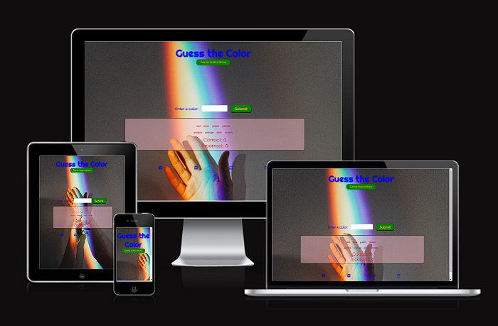
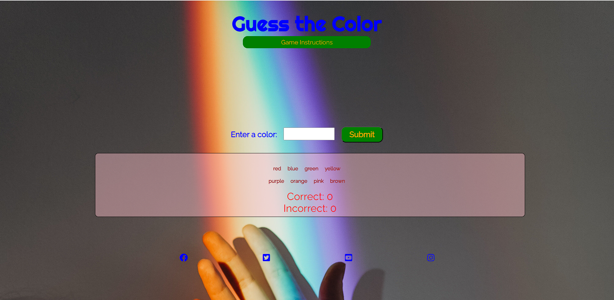
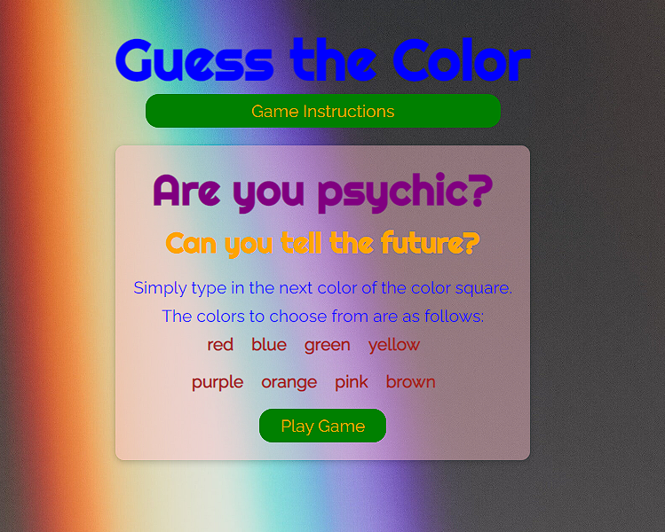
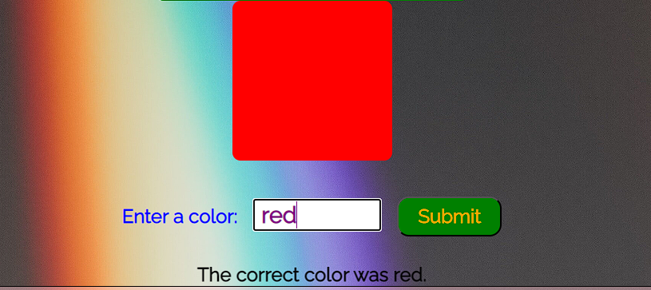
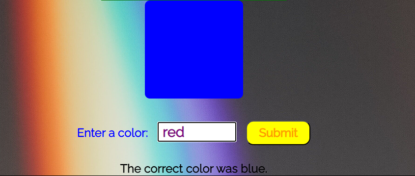
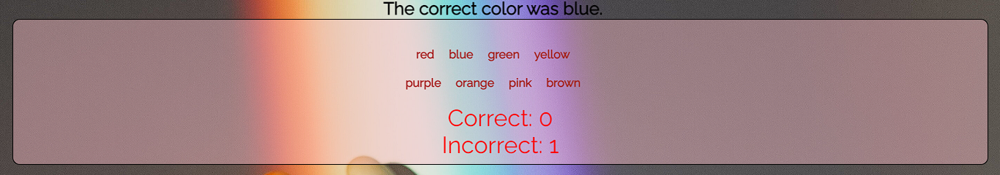
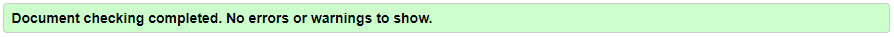
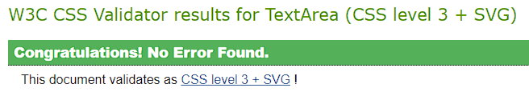
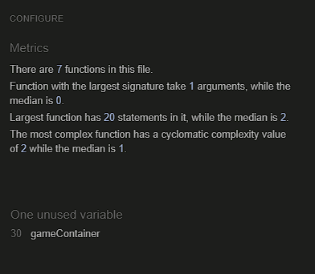
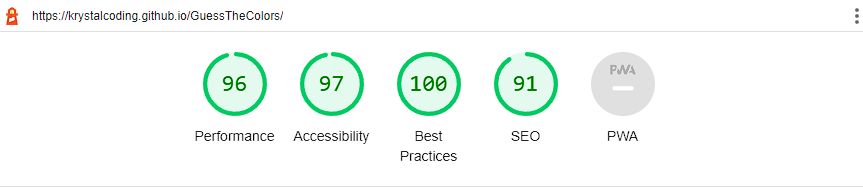

# Guess the Color Game

Welcome to my second project for [Code Institute's](https://codeinstitute.net) Full Stack Development 
Educational Program!

[Click to view](https://krystalcoding.github.io/GuessTheColors/) my website with a fully interactive design.

Guess the Colors is a simple, but interactive game designed for web pages shown on different screen sizes. The First impression is a colorful, simple, and lighthearted game where the User can click a button to see instructions on how to play (simply type in the next color of the color square), and provides the color options which can be chosen, resulting in a correct or incorrect incremental score.

However, there is a deeper meaning at play (...get it? ...play?): there is no winning. No matter how clever a person is with their guesses, they will fall further and further behind the longer they play. It is, ultimately, a disguised lesson for the futility of trying to plan ahead, while unable to predict the future. We must try, to play, but the odds are against getting ahead based on anything but pure luck.

Users of this web page will be able to find all the information they need about how the functionality works, a colorful and lighthearted design with clickable buttons, a background picture meant to inspire, and links to the creator's social media.

## Features
- Navigation
    - The Header at the top of the home page displays the name of the game "Guess the Color".
    - Just underneath the header is a clickable button the user can click to reveal the Game Instructions.
    - After making a guess, there is a large, central color box that displays the color the user was attempting to guess.
    - Beneath the color box is the label for a text box where the user can enter their guess for what the mystery color will be revealed as.
    - Underneath the Guess box and Submit button is the score box to tally the correct and incorrect guesses, along with the color options the user has to guess from.
    - Finally is a footer with links to social media pages.

- Game Instructions
    - The Game Instructions button has a clickable functionality that reveals the rules of the game for the user.
    - Contained within this section is a button to again hide the Instructions and return to the home page containing primarily the Game Area with the functions to play the game.

- Game Area
    - The Game Area contains the functionality of gameplay. There is a color box, initially hidden, which after the user enters a guess (either by using the "Enter" key or clicking the "Submit" button with a mouse pointer) is revealed in the bold color the user was attempting to guess.
    - Beneath the text box is a message telling the user what the correct color was all along, whether or not they guessed correctly.

- Score Area
    - In the space below the game section is the area that displays the color options the user has to type into the text box. They may type in whatever they please, but only one of the color options presented has a chance of being correct.
    - That same section contains the correct and incorrect scores. It is incremented by one point with each right or wrong answer.

- Footer
    - The footer section displays four different icons in the color theme. When clicked, they are working links to what would be the Club's Facebook, Twitter, YouTube, and Instagram accounts.

- Design Considerations
    - The color scheme choice for both the background image and font and game box colors were meant to convey a lighthearted and happy game. This was done both to draw in the user and entice them to play the game (much like the game of life), and also to contrast with the more sinister trap of never being able to win the game.
    - The fonts of Raleway and Righteous, as well as the bright colors for the text were chosen for these same reasons. They appear as a childlike game, soft around the edges and easy to read even on small screens.
    - Layout was designed in the simplest way possible, easy for the user to navigate and quickly understand the features available.

## Testing

### Bugs
- There were no notable bugs to fix in this very simple webpage game design.

### Validator Testing

| Validator     | Pass | Fail     |
| :---        |    :----:   | :----: |
| HTML      | &check;       | 0   |
| CSS   | &check;        | 0      |
| JavaScript      | &check;        | 0   |
| Lighthouse   | &check;         | 0      |
| Grammarly      | &check;       | 0   |

- HTML
    - The HTML code was validated and cleared via [W3C HTML Validator](https://validator.w3.org/#validate_by_input).

- CSS
    - The CSS code was validated and cleared via [W3C CSS Validator (Jigsaw)](https://jigsaw.w3.org/css-validator/).

- JavaScript 
    - My JavaScript code was validated by [JSHint](https://jshint.com/).

- Accessibility
    - I confirmed that the color palette and fonts are easily accessible by using [Lighthouse](https://pagespeed.web.dev/report?url=https%3A%2F%2Fkrystalcoding.github.io%2Fantisocial-dog-meetups%2F&form_factor=desktop) in devtools.

-Grammar 
    - Grammer in README.md was checked on [Grammarly](https://app.grammarly.com/).

### Unfixed Bugs/Flaws
- In the future, as it is very unlikely the deeper philosophical nature of this faux-game will be fully appreciated, I will make a max-score that ends in a win/lose scenario.
- I would like to, in time, create a function for the Game Area to disappear when the Game Instructions area is visible.

## Deployment
- The Club's Website was deployed using GitHub pages. The steps to deploy are the following:
    - From the [GitHub repository](https://github.com/KrystalCoding/GuessTheColors), navigate to the Settings tab.
    - On the left-hand side, scroll down to the navigation link titled Pages.
    - From the branch source drop-down menu, select the option Master.
    - When the page was refreshed, the link for deployment was provided.
Once again, the live link can be found here: [Guess the Colors Game](https://krystalcoding.github.io/GuessTheColors/).

## Credit

### Content
- The code to design the interactivity, and format the social media footer, was inspired by the [Love Maths](https://github.com/KrystalCoding/love-maths) Project with tutorial videos by [The Code Institute](https://codeinstitute.net). Assistance from tutors at the Institute was also utilized for image responsiveness.
- Resource [W3 Schools](https://www.w3schools.com/js/) was used in assisting to create the interactivity of the hidden sections.
- [GitHub](https://docs.github.com/en/get-started/writing-on-github/getting-started-with-writing-and-formatting-on-github/basic-writing-and-formatting-syntax#images) provided the basic writing and syntax used in this README.md file.
- [Am I Responsive](https://ui.dev/amiresponsive?url=https://krystalcoding.github.io/antisocial-dog-meetups/) was responsible for creating the responsive design photo used at the beginning of this README.md.

### Media
- The background image was all borrowed from [Pexels](https://www.pexels.com/).
- The icons were borrowed from [Font Awesome](https://fontawesome.com/start).